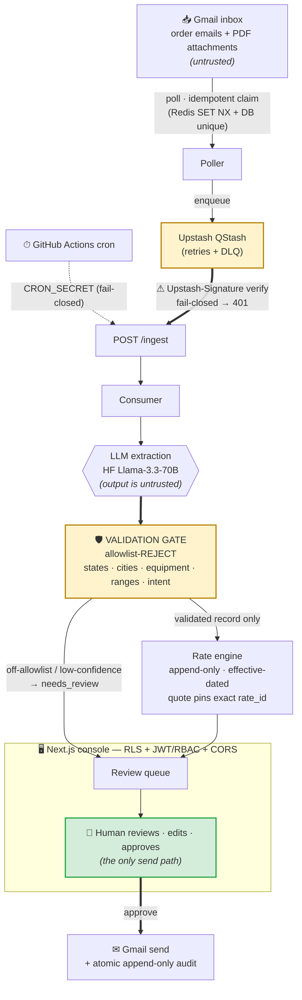

# freight-pipeline

**An injection-aware, human-supervised pipeline that turns inbound freight order emails into structured, priced quotes — safely.**

Logistics brokers get load orders and rate enquiries as free-text email (and PDF
rate confirmations). Reading them, pulling out the lane / equipment / weight, pricing
the load, and replying is manual, repetitive work. This pipeline automates the
reading and pricing — but treats every extracted field as **untrusted input** and
**never lets the model send anything**. An LLM proposes; a human disposes.

The novelty is the safety model, not the automation: a prompt-injection in an order
email cannot drive a wrong quote or an unattended send. That property is enforced by
a deterministic validation gate and a mandatory human approval step — proven, not
asserted (see [Evaluation](#evaluation-measured)).

> **This is a synthetic showcase, not a production deployment.** Data is synthetic,
> the deploy runs on free tiers, and several edges are deliberately left open and
> documented (see [Limitations](#limitations-the-honest-edges)). It is built to
> demonstrate the architecture and the injection defense, not to run a real brokerage.

**Live:** console → [freight-pipeline.vercel.app](https://freight-pipeline.vercel.app) ·
API → [freight-pipeline.onrender.com/health](https://freight-pipeline.onrender.com/health)
(Render free tier — the backend sleeps when idle. If the API link hangs, that's the
cold start, not a failure; give it ~30–60s and retry.)

---

## Architecture

The diagram mirrors the data flow and trust boundaries in
[`THREAT_MODEL.md`](THREAT_MODEL.md) — the two are kept in agreement on purpose. The
novel parts are the two gates (`⚠` signature verify, `🛡` validation gate) and the
`👤` human-in-the-loop send.



Untrusted input (email/PDF, and the LLM's own output) flows left-to-right and cannot
reach the rate engine until it has passed the allowlist-reject gate; nothing goes out
without a human.

---

## How it works

A synthetic order email flows: **ingest → extract → validate → rate → review → send.**

1. **Ingest.** A poller reads the inbox behind a `GmailClient` interface and enqueues
   each new message on QStash. Every message is keyed on its `gmail_message_id`
   (Redis `SET NX` + a DB unique constraint), so it is processed and replied to **at
   most once**.
2. **Extract.** The consumer calls an LLM (`LLMClient` → Hugging Face serverless) for
   one structured extraction: intent classification + the order fields. PDFs go
   through the same path (text layer → extraction).
3. **Validate (the injection defense).** Every extracted field is untrusted. A
   deterministic gate **allowlist-rejects** anything off-spec — USPS states, a city
   name format, an equipment allowlist, numeric weight ranges, a 5-value intent — and
   routes rejects (or low-confidence) to human review. It rejects; it never strips an
   injection out and keeps the rest.
4. **Rate.** A validated record reaches the rate engine: a contracted-lane lookup, or
   a route-aware computed fallback. `rates` is **append-only and effective-dated** — a
   surcharge update inserts a new version, never an UPDATE — and a quote pins the exact
   `rate_id` it used.
5. **Review & send.** The Next.js console shows the proposal, confidence, and rate
   version. A reviewer edits/approves; **only an explicit human approval triggers the
   Gmail send**, written atomically with an append-only audit record.

### Invariants (enforced, not aspirational)

- **The LLM never sends.** No model output triggers an irreversible action; the only
  outbound path is the human-approved `/review/send`.
- **All extracted fields are untrusted** → allowlist-reject before the rate engine.
- **`rates` and `audit_log` are append-only.** Quotes pin a `rate_id`; `audit_log` is
  insert-only and tamper-evident (UPDATE/DELETE/TRUNCATE blocked by a trigger).
- **RLS on every table.** Reviewers see only their assigned deals; admins see all;
  invariant-bearing tables are server-side-write-only.
- **Idempotency end-to-end** on `gmail_message_id`; the deal state machine forbids
  skips; an unknown/blocked carrier MC parks the deal for a human.

---

## Evaluation (measured)

Phase 9 ran the real `extract()` gate over a 14-sample labeled corpus (4 normal /
4 malformed / 6 adversarial), priced the route-aware engine against the live DB, and
load-tested the ingest path. Instruments: `scripts/eval_corpus.py`,
`scripts/eval_rates.py`, `scripts/locustfile.py`, `scripts/eval_llm_latency.py`.

### Extraction & classification

Measured **2026-06-18** on `Llama-3.3-70B-Instruct` via Hugging Face serverless
(provider **`hyperbolic`**, observed through `:cheapest` routing; **server-default
sampling — a measured-on-a-date figure, not bit-reproducible**).

- **Classification 13/14 (92.9%)** — normal 4/4, adversarial 6/6, malformed 3/4. The
  one miss is the no-text-layer PDF sample (empty body → `other`); it routes to human
  review, so the miss is safe. OCR is out of scope.
- **Field extraction 30/30 (100%) canonical** (the post-gate values that actually feed
  the rate engine) vs **26/30 (86.7%) raw** — the gap is the validation gate
  canonicalizing 4 model outputs (e.g. `"dry van"` → `dry_van`) that would otherwise
  miss. The gate adds accuracy, not just safety.
- **No fabricated fields.** One negotiation reply carried its lane verbatim from the
  email **subject** line — input-grounded extraction the corpus didn't label as
  expected, not invention (and it produced no draft).

### Injection containment (the system's novelty)

Every extracted field is untrusted and passes a deterministic allowlist-reject gate
before any rate logic; a human approves every send.

- **0 of 6 adversarial samples produced a draft containing attacker-controlled data** —
  the safety invariant. Real-model run: 6/6 contained, 0 escapes, backed by a
  model-independent fooled-model sweep (`tests/test_containment.py`) that holds even if
  the model is fully compromised.
- 3 of the 6 were truth-legit orders that merely wrapped an injection: the model
  ignored the injected text and quoted the **true** on-table lane (`escaped=[]`) —
  containment succeeding, not a false accept.

### Route-aware rate engine

Priced live against seeded effective-dated `pricing_components` (new effective-dated
versions are how an operator tunes pricing).

> ⚠ **These are synthetic, operator-tunable rates — NOT live market quotes.** The
> dollar totals below come from seeded components, not a market feed.

| lane (dry_van) | miles | linehaul | deadhead | margin | FSC | all-in |
|---|---|---|---|---|---|---|
| Chicago, IL → Dallas, TX | 925 | $1,665.00 | $199.80 | $279.72 | $372.96 | **$2,517.48** |
| Atlanta, GA → Miami, FL | 665 | $1,197.00 | $143.64 | $201.09 | $268.12 | **$1,809.85** |
| Newark, NJ → Boston, MA | 225 | $405.00 | $48.60 | $68.04 | $90.72 | **$612.36** |

Same equipment, three lanes, three totals — the old flat $2,200 is structurally dead.
Deadhead scales with distance (12% of linehaul); a `container` lane prices flat
($540.00) to show the equipment-driven model switch (drayage vs per-mile).

### Load, latency & cost

Load test: locust → signed `POST /ingest` on a local stack with the **mock LLM**
(isolating pipeline latency from model time), through the real QStash signature gate,
each request a unique pre-seeded id so `finalize` does real work.

- **Pipeline latency p50 120 ms / p95 140 ms / p99 170 ms** — excludes model time;
  local stack, dominated by DB pooler round-trips.
- **~70 req/s sustained, 0 failures** — far beyond the ~80/day this system is sized
  for; the headroom means volume is never the constraint. At 40 concurrent users it
  degrades to backpressure (p50 410 ms) with **still 0 failures**.
- **Real-model latency median 3.63 s / p95 4.44 s** (live HF) — the model-dominated
  number, **separate** from the pipeline latency above; they are not the same thing.
- **319 tokens/email** (237 prompt + 82 completion, measured) — **sub-cent per email**
  at current Llama-3.3-70B serverless rates. The token count is the hard number; the
  dollar figure is a market variable.

### The eval caught two live production defects

The eval surfaced **two latent defects already running in production and silently
degrading it** — before either caused a visible failure:

- an **engine-per-request connection leak** that was leaking a connection pool against
  the live Supabase pooler on **every `/ingest`** in production; and
- a **fenced-JSON parse-and-swallow** in the HF client that was silently routing valid
  model responses to human review in production.

Neither would have shown up as an error until much later (a pooler-exhaustion outage; a
quietly rising review queue). The eval is what made them fail fast and visibly. Both are
written up in [`DECISIONS.md`](DECISIONS.md).

---

## Security & threat model

The system is modeled around its **actual trust boundaries** (QStash→`/ingest`,
cron→jobs, browser→`/review`, **LLM output→engine**, DB/multi-tenant, secrets). The
centerpiece is the injection defense: the LLM emits structured data only and can never
trigger an action, so an injection is contained by a deterministic allowlist-reject
gate plus the mandatory human send gate. Residual risks (real-model adversarial
accuracy, the at-least-once send window, free-tier backup posture) are tracked openly.
Full model, boundary table, and residuals: [`THREAT_MODEL.md`](THREAT_MODEL.md).

---

## Limitations (the honest edges)

A showcase is more trustworthy when it names its own edges. These are deliberate and
documented, not unknowns:

- **Synthetic data only.** No real broker traffic or PII; column-level PII encryption
  is descoped to an at-rest baseline (a real-PII deployment is a pre-prod gate —
  THREAT_MODEL R3).
- **No OCR.** Image-only / no-text-layer PDFs route to human review rather than being
  read (the one classification miss). OCR is out of scope.
- **Send is at-least-once, not exactly-once.** If Gmail delivers and the process
  crashes before the send is marked, a retry can re-send. The claim pattern prevents
  duplicate *approvals* from double-sending, and every outbound carries an
  `X-Freight-Quote-Id` marker for a future mailbox-dedup (not yet built) — THREAT_MODEL R4.
- **Free-tier, no backups.** Supabase free tier has no automated backups/PITR, so the
  restore gate is **accepted-open** for this synthetic deployment (a production
  deployment would need Supabase Pro) — see [`RECOVERY.md`](RECOVERY.md) §5.
- **Real-model adversarial accuracy is bounded by the eval corpus**, not a full
  red-team. The *gate* contains injection regardless of model behavior; how often the
  model itself is fooled is measured only over the 14-sample set (THREAT_MODEL R1/R8).
- **Right-sized for low volume (~80/day).** No Kubernetes, service mesh, multi-region,
  or self-hosted load balancer — over-engineering is treated as a defect here.

---

## Stack

Python 3.12 · FastAPI · Pydantic · SQLAlchemy · Supabase (Postgres + Auth + RLS +
Storage) · Redis (Upstash) · Upstash QStash · Hugging Face serverless inference ·
Next.js + TypeScript + Tailwind + shadcn/ui (`web/`). Backend on Render, console on
Vercel, both auto-deployed from `main` behind a CI quality gate (lint · type · test ·
build · prod-image build).

Implementations sit behind interfaces (`LLMClient`, `GmailClient`, the queue) and are
swapped by config, never by rewriting call sites — so the whole pipeline runs locally
on mocks.

## Quickstart (local)

Requires [`uv`](https://docs.astral.sh/uv/), Docker, and the
[Supabase CLI](https://supabase.com/docs/guides/cli). Supabase Postgres (local stack
on `:54322`) is the database of record; Docker Compose supplies only Redis; the API
runs via `uv run`.

```bash
uv sync                       # create the env from pyproject/uv.lock
cp .env.example .env          # then fill in real values (never commit .env)
supabase start                # Postgres + Auth + RLS + Storage on :54322 — applies
                              # migrations + seed on first init (DB of record)
docker compose up -d          # Redis (Supabase has none)
uv run uvicorn freight.api.main:app --reload   # API: /health, /ingest, /poll
uv run pytest                 # run the test suite
uv run ruff check . && uv run mypy .
```

> `supabase start` already applies the migrations and seed. To re-apply them to a clean
> state on an already-running stack, run `supabase db reset` (this drops and recreates —
> it discards local data).

## Repo map

- [`CLAUDE.md`](CLAUDE.md) — the behavioral contract for this repo (binding invariants).
- [`PLAN.md`](PLAN.md) — the phased build plan (spine first, then hardening/deploy/showcase).
- [`DECISIONS.md`](DECISIONS.md) — the decision log: every non-obvious choice and dead-end, dated.
- [`THREAT_MODEL.md`](THREAT_MODEL.md) — boundary-driven threat model + residual risks.
- [`RECOVERY.md`](RECOVERY.md) — operational runbook (DLQ replay, stuck send, restore, key rotation).
- `supabase/migrations/` — the schema + RLS source of truth.
</content>
